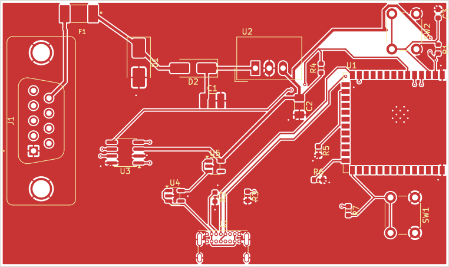

# OBD2Dash

An ESP32-S3 CAN-to-BLE bridge for an iPad vehicle dashboard. The firmware discovers each ECU's supported current-data PIDs and forwards complete raw responses through a versioned BLE GATT stream.

## Status

The original reader was a breadboard diagnostic sketch. This revision replaces its receive path and adds supported-PID discovery, ISO-TP reassembly and BLE. The new firmware has host regression tests; vehicle and iPad integration testing are still required. Do not represent the new implementation as vehicle-validated yet.

The PCB is a compact prototype, not a fabrication-qualified automotive module. See hardware/Review.md for the supplied review and its unresolved decoupling, component-selection and power-protection findings. That report is preserved as source evidence, not a new electrical signoff.

## Scope of "all PIDs"

- Service 01 (current powertrain data), PID 00 through FF.
- Every advertised support page, not a fixed shortlist of dashboard sensors.
- Separate support maps and responses for eight physical ECU addresses.
- Classical CAN with 11-bit IDs: requests 7E0–7E7, responses 7E8–7EF.
- 500 kbit/s by default; configurable 250 kbit/s.
- Raw response preservation, including multi-frame PIDs. The dashboard applies PID-specific formulas.
- Not manufacturer-specific services, all OBD diagnostic modes, 29-bit CAN, CAN FD, or legacy K-line/J1850.

A vehicle cannot return a PID it does not implement. A discovery timeout is reported as incomplete, not silently interpreted as no support.

## Data flow

CAN request -> ECU response -> ISO-TP reassembly -> timestamped raw PID record -> 20-byte BLE fragments -> iPad reassembly and decoding.

There is one outstanding physical request at a time. All supported data PIDs are polled round-robin; support pages are refreshed between sweeps after at least 60 seconds. Requests have a 50 ms minimum gap, 300 ms inactivity timeout and 5-second absolute deadline. Discovery retries transient failures up to three times. Sample failures produce status records and are retried on later sweeps.

This prioritizes coverage rather than high-rate gauges: polling many PIDs or offline ECUs makes a sweep longer. No fixed update-rate guarantee is claimed.

## Hardware and build

The supplied PCB identifies ESP32-S3-WROOM-1 and TI TCAN337:
- GPIO4 -> TCAN337 TXD
- GPIO5 <- TCAN337 RXD

Confirm the external connector cable pinout and power design before connecting hardware. The firmware sends only Mode 01 requests and ISO-TP flow control; BLE provides no arbitrary CAN-write interface.

Open firmware/obd2dash/obd2dash.ino in Arduino IDE. Select ESP32S3 Dev Module using the Espressif ESP32 package. BLE and TWAI ship with that package. Configure pins and bitrate in Config.h. No WiFi credentials or cloud services are required.

    arduino-cli compile --fqbn esp32:esp32:esp32s3 firmware/obd2dash

## Repository

- firmware/obd2dash: request engine, protocol core and BLE stream
- docs/BLE.md: exact wire format and app integration
- tools/decode_ble.py: reference decoder for notification hex lines
- tests: host protocol and decoder regression tests
- hardware: supplied KiCad source, local footprints, DRC reports and previews

## Tests

    g++ -std=c++17 -Wall -Wextra -Werror tests/protocol_test.cpp -o protocol_test
    ./protocol_test
    python -m unittest discover -s tests -p "test_*.py"

The C++ tests exercise support-map boundaries, independent ECU maps, all 4,088 ISO-TP multi-frame lengths from 8 to 4,095 bytes, sequence rollover/errors, negative responses and maximum-length BLE serialization. Tests do not replace CAN simulator, vehicle or radio testing.

## References

- [Espressif BLE notification example](https://github.com/espressif/arduino-esp32/tree/master/libraries/BLE/examples/Notify)
- [ISO-TP transport overview](https://docs.kernel.org/networking/iso15765-2.html)
- [OBD support-page explanation](https://www.csselectronics.com/pages/obd2-explained-simple-intro)

## Verified build

Compiled successfully with Espressif Arduino-ESP32 3.3.11 (bundled BLE 3.3.11), target esp32:esp32:esp32s3, board defaults.

- Program storage: 576,620 / 1,310,720 bytes (43%).
- Static global RAM: 31,744 / 327,680 bytes (9%).
- Host C++ protocol regression suite: passed.
- Python BLE decoder suite: 4 tests passed.

No device was flashed. These compile figures do not measure peak runtime RAM. Vehicle/CAN simulator tests and iPad integration remain outstanding; follow docs/VALIDATION.md.

## iPad dashboard

The native SwiftUI receiving app is in [ipad](ipad/README.md). Open ipad/OBD2Dash.xcodeproj on a Mac, select your signing team and run on an iPad with iPadOS 17+. It automatically connects while foregrounded and displays RPM, speed and coolant gauges alongside a searchable list of supported/observed PIDs.

Unknown PIDs are shown as raw bytes, not guessed numbers. The app has an explicitly labeled --demo mode for UI previews. See the app README for build and physical-device validation instructions.
